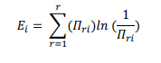
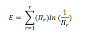
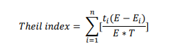
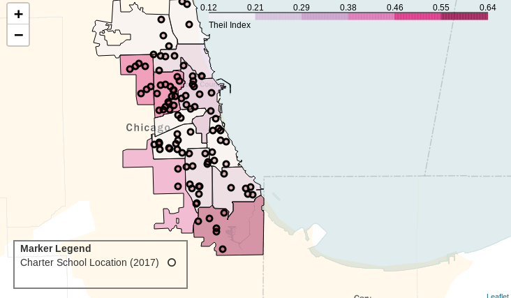
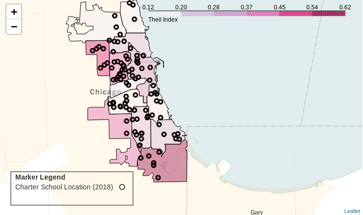
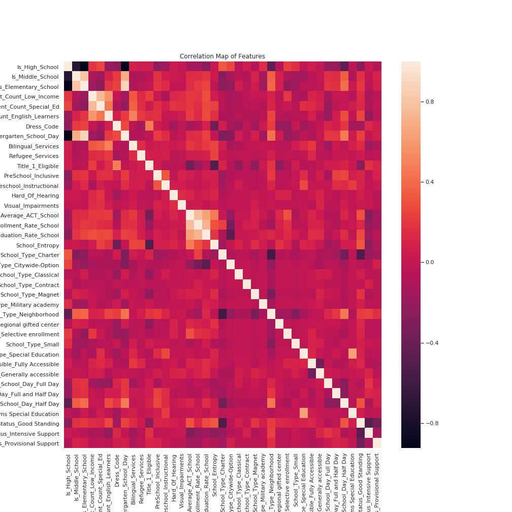

# Measuring Segregation in Chicago Public Schools

## Dataset

School data from the 2016-2017, 2017-2018, and 2018-2019 school years was obtained from the Chicago Public Schools website. Each dataset contained around 90 features and 650 rows representing every public school in the city of Chicago. Additionally, I worked with another three datasets, also obtained from the Chicago Public Schools website that contained the same schools, but also gave the district each of the schools in the first dataset was located in.

## Background
Many cities are increasingly investing public funds into charter schools. However, many Americans are becoming concerned about the privatization of education where minimally regulated corporations helm these publicly funded schools. The Los Angeles Unified School District has estimated that charter schools receive a large share of public funds at the detriment of public schools. In addition, managerial neglect leads some charter schools to provide poor quality education with high attrition rates, with little oversight.

Recently, the NAACP has come out in condemnation of charter schools, stating that they serve to increase institutionalized segregation. Quite often, the student bodies of charter schools do not reflect the makeup of the communities they serve. There are many factors to lead to this disparity: selectivity during the admissions process, acceptance of students outside the charter school boundaries, etc.

## Metrics

Sociologists use many different metrics to calculate segregation. Chicago is a very diverse city that has a very broad racial makeup. For this reason, it was important to choose a metric that would take all the racial subgroups in a school into consideration. I finally settled on the Theil index, which is calculated as follows:

  

Where Ei indicates the entropy of a school, E indicates the entropy of a district,  indicates a groups total share of a school or district, ti indicates the total population of a school, and T, the total population of the district. The Theil index will range from 0 to 1, where 0 indicates a very diverse district and 1 indicates a highly segregated district.

## Data
To see interactive maps made in Folium, look at the jupyter notebooks in the notebooks folder. The following images are screenshots of the interactive maps.
  
Map representing the Theil index for each public network in Chicago for the 2016-2017 school year (network is the term the city of Chicago uses for its school districts). The circles indicate charter school locations. The shading of these circles shows the theil score for charter schools.

  
Map representing the Theil index for each network in Chicago for the 2017-2018 school year. The circles indicate charter school locations. The shading of these circles shows the theil score for charter schools.

### 2017 Data
|   Network   | AUSL  | Charter | Contract | ISP   | Network 1 | Network 2 | Network 3 | Network 4 | Network 5 | Network 6 | Network 7 | Network 8 | Network 9 | Network 10 | Network 11 | Network 12 | Network 13 | Options | Service Leadership Academies |
|:-----------:|-------|---------|----------|-------|-----------|-----------|-----------|-----------|-----------|-----------|-----------|-----------|-----------|------------|------------|------------|------------|---------|------------------------------|
| <b>Theil Index</b> | 0.483 | 0.559   | 0.204    | 0.369 | 0.151     | 0.120     | 0.479     | 0.270     | 0.474     | 0.300     | 0.140     | 0.174     | 0.151     | 0.433      | 0.258      | 0.257      | 0.635      | 0.438   | 0.193                        |  

### 2018 Data

|   Network   | AUSL  | Charter | Contract | ISP   | Network 1 | Network 2 | Network 3 | Network 4 | Network 5 | Network 6 | Network 7 | Network 8 | Network 9 | Network 10 | Network 11 | Network 12 | Network 13 | Options | Service Leadership Academies |
|:-----------:|-------|---------|----------|-------|-----------|-----------|-----------|-----------|-----------|-----------|-----------|-----------|-----------|------------|------------|------------|------------|---------| ------------------------------|
| <b>Theil Index</b> | 0.487 | 0.563   | 0.218    | 0.409 | 0.151     | 0.115     | 0.472     | 0.254     | 0.426     | 0.290     | 0.150      | 0.187     | 0.152     | 0.434      | 0.228      | 0.254     | 0.620      | 0.437   | N/A                        |

Performed 13 T-tests comparing the means of school entropy values between charter schools and all the public school networks. I used an alpha value of 0.05. Applying the Bonferroni Correction gives an alpha value of <b>0.0038</b>.

|       Network       | Charter | Network 1  | Network 2  | Network 3 | Network 4 | Network 5 | Network 6  | Network 7 | Network 8 | Network 9 | Network 10 | Network 11 | Network 12 | Network 13 |
|:-------------------:|---------|------------|------------|-----------|-----------|-----------|------------|-----------|-----------|-----------|------------|------------|------------|------------|
| Number of Schools   | 100     | 45         | 32         | 26        | 33        | 34        | 30         | 30        | 28        | 28        | 34         | 42         | 36         | 35         |
| Mean School Entropy | 0.34    | 1.01       | .42        | 1.24      | .42       | .80       | .35        | .24       | .38       | .25       | .57        | .24        | .20        | .23        |
| T-test  p-value     | N/A     | 9.7x10^-27 | 1.9X10^-33 | 0.18      | 7.1X10^-7 | .75       | 1.56x10^-9 | 0.05      | 0.40      | 0.12      | 0.00023    | 0.046      | 0.004      | 0.03       |

Networks 3, 5, 7, 8, 9, 11, 12, 13 all had high p-values, meaning there is no evidence that these schools have a different mean entropy score from charter schools. Over half the public school networks show no difference from charter schools in diversity.  

## Regression analysis
I also wanted to take a look at which features from my dataset influenced segregation in CPS. Therefore, I decided to perform a linear regression in order to see which features are statistically significant (beta value not equal to 0).

The segregation metric involves a value (Ei) that is calculated over all the schools in a district. Unfortunately, this introduces data leakage into the analysis, because the response variable has some influence from the test data, when performing a train-test split. One solution is to calculate the district entropy over the train set only, adjust the T value for the amount of schools in the district in the train set, and use that value of E and T when performing my calculations on the test set. However, to be careful, I decided to use school entropy as my response variable, in order to eliminate a lot of the issues  that arise when taking an average. I also needed to remove any features I used to calculate school entropy from my datset.

A vanilla linear regression performed on normalized data using the statsmodels package, which provides a clearer readout than sklearn for this many features, shows the following features as significant:
Is_High_School, Student_Count_Low_Income, Student_Count_Special_Ed, Student_Count_English_Learners, Dress_Code, Bilingual_Services, Refugee_Services, Title_1_Eligible, Average_ACT_School, PreSchool_Inclusive 	

This model yielded an Adjusted R2 of 0.56. Looking at the correlation map of the features below, it seems like there might be multicollinearity issues. This is supported by my model also having a high Condition Number. Taking out certain collinear features may greatly import my Adjusted R2. While this is not ideal, it is enough to be able to identify some potential predictors of segregation.

  

## Future Directions

If I had more time, I would have also calculated an exposure metric for each school district. This metric only looks at one group in comparison to the rest of the population, which would allow me to get a better sense of which racial group is over-represented in a segregated district. For example,
the exposure metric could be used to compare the two most heavily represented groups in the region:  

  

Additionally, it would have been beneficial for me to perform a beta regression on this data. A beta regression would have been powerful because it is especially effective at modeling proportions. I would have to assume that the data follows a beta distribution in order to use a beta regression.
